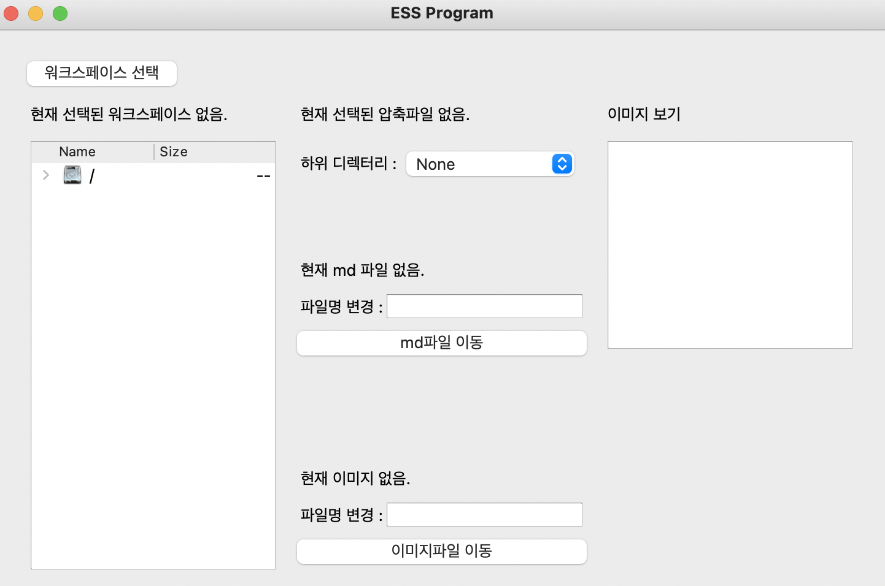
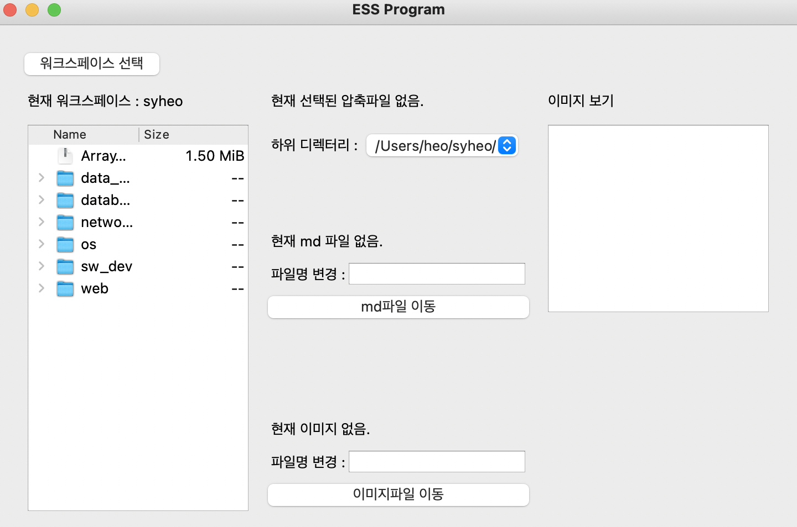
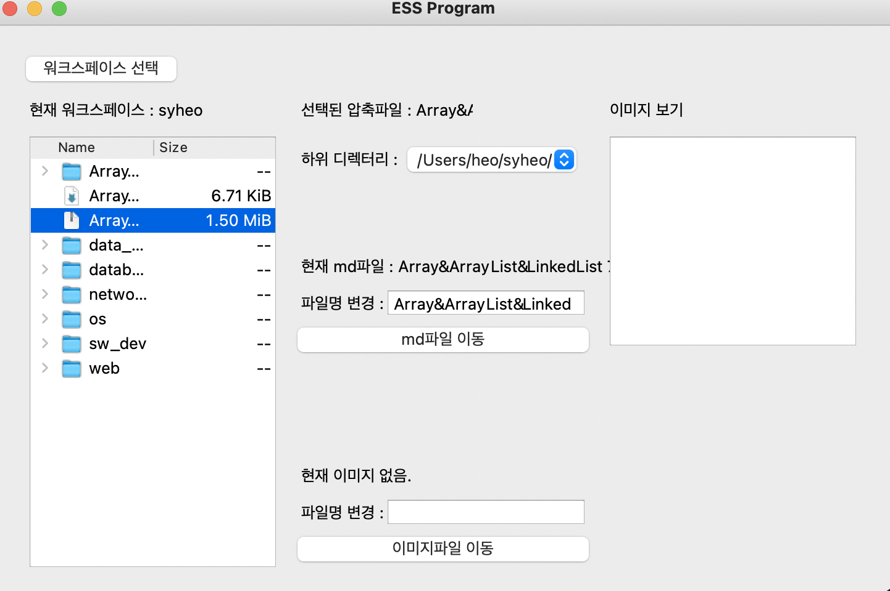
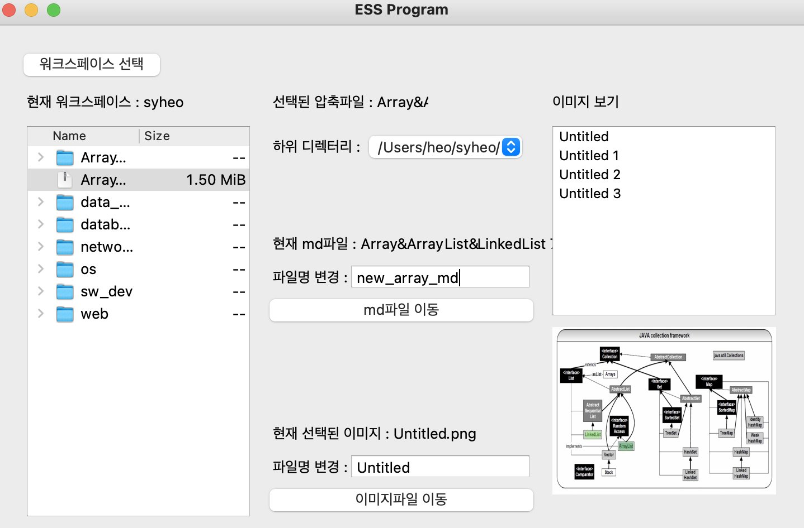
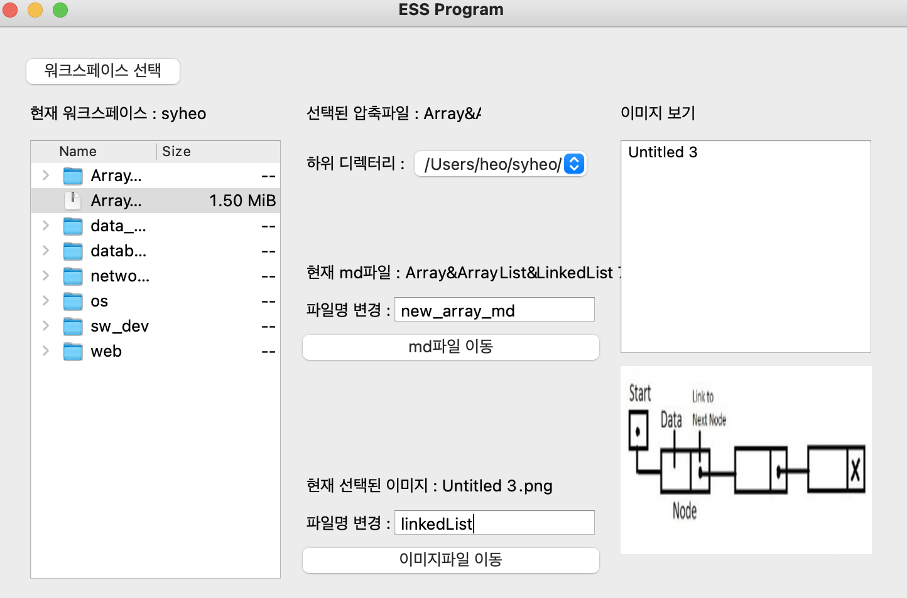

# ESS-Program
Easy Start Study(쉽게 스터디를 하게 해주는 프로그램)

# ❓프로그램 메뉴얼❗

## 🤼‍♂️ 1) Notion 내보내기

### ❗주의❗→ 저장위치는 선택할 워크스페이스 폴더

## 🤼‍♂️ 2) python ess.py

## 🤼‍♂️ 3) 워크스페이스 위치 선택

### 📌왼쪽 상단 '워크스페이스 선택'버튼 클릭

### 📌워크 스페이스 선택 후 화면

## 🤼‍♂️ 4) zip 파일 더블클릭

### 📌압축해제 할 zip 파일 더블클릭

## 🤼‍♂️ 5) md 파일명 변경

### 📌md파일명을 변경 후 'md파일 이동' 버튼 클릭

## 🤼‍♂️ 6) image 파일명 변경

### 📌image파일명을 변경 후 '이미지파일 이동' 버튼 클릭

